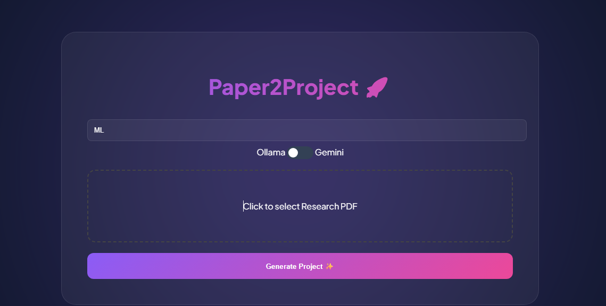
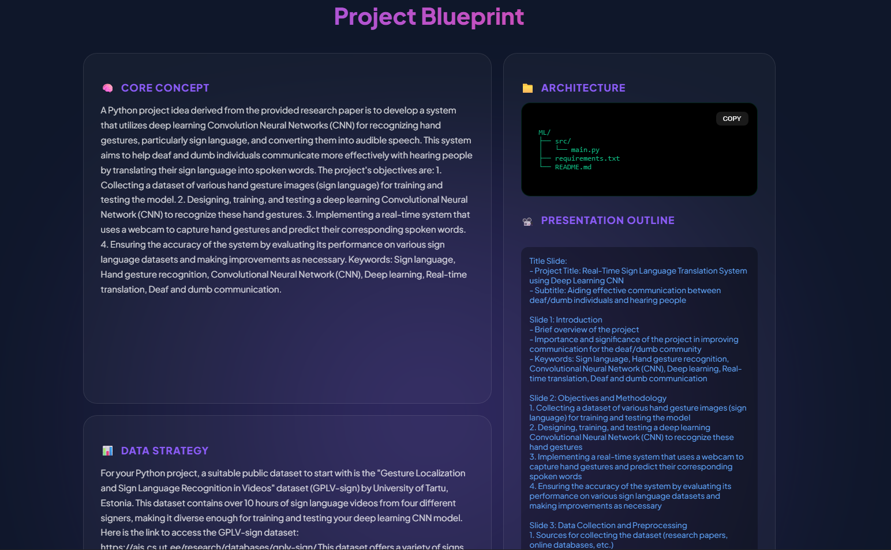
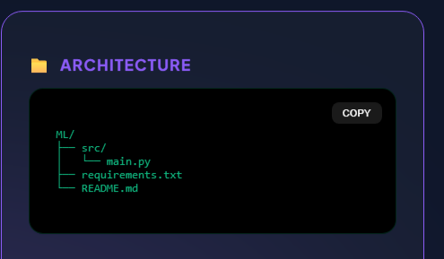

<h1 align="center">📄 Paper2Project</h1>

<p align="center">
  <em>Transform any research paper into a working Python project & presentation – instantly!</em>
</p>

<p align="center">
  
  
  
  
</p>

---

## **Paper2project_Agent**
 is a powerful developer tool designed to automate the conversion of research papers into comprehensive
Python projects and presentation materials. It orchestrates AI-driven workflows for idea extraction, dataset sourcing, code
generation, and slide creation, enabling rapid development and visualization of research insights.

## **Why Paper2project_Agent?**
This project simplifies complex research-to-code workflows by integrating multiple automation modules. 
The core features include:
>
> 🧩 AI-Powered Project Scaffolding: Automatically generates organized project structures based on research ideas.
> 
> 🚀 Code & Dataset Generation: Facilitates rapid prototyping with dynamic code snippets and relevant dataset discovery.
>
> 🎨 Automated Presentation Creation: Converts project summaries into professional slides for quick visualization.
>
> 🐳 Containerized Deployment: Ensures consistent environments for scalable and reliable execution.
>
> 🔍 Research Paper Summarization: Extracts key concepts from PDFs to inform project development.
>
> ⚙️ Seamless User Interface: Provides an intuitive web interface for easy interaction and project management.

All this, directly from a single PDF! 🧾 ➜ 💻📊

---

## 🔥 Features

- 🔍 **PDF Analysis**: Extracts the core idea from the uploaded research paper
- 📂 **Auto Project Generator**: Builds a complete folder structure with boilerplate code
- 📊 **Dataset Suggestion**: Recommends relevant open-source datasets with direct links
- 🎞️ **Slides Generator**: Creates a PowerPoint presentation summarizing the paper
- 💾 **One-Click Download**: Instantly download your generated Python project and slides
- 🎨 **Modern UI**: Sleek interface with animations and responsive layout

---

## 📸 Screenshots


## 🖥️ Main Page


---

## ⏳ Loading Page


---

## ✅ Result Page


---

## 🗂️ Project Structure


---

## 📥 Download PPT and Project Files


## ⚙️ How It Works

1. 📝 Enter a project name and upload a research paper (`.pdf`)
2. 🤖 LLM extracts the core idea
3. 🔍 Dataset is searched and summarized
4. 🐍 Project structure and boilerplate code are generated
5. 🖼️ PowerPoint slides are created
6. ⬇️ Files are offered for download

---

## 🛠️ Tech Stack

| Component    | Tools Used |
|--------------|-------------|
| **Frontend** | HTML, CSS, JS (Vanilla) |
| **Backend**  | Python, Flask |
| **GenAI**    | Ollama LLM (or OpenAI/Groq API) |
| **OCR**      | Tesseract OCR / Google Vision API (optional) |
| **Slides**   | `python-pptx` |
| **Project Output** | Auto-generated `.py` & `.pptx` files |

---

## 🚀 Getting Started

### 🔧 Prerequisites

Make sure Python 3.10+ is installed.

Install dependencies:


```bash
pip install flask python-pptx

---

Any leads are appreciated—please feel free to contribute and help make this project better.