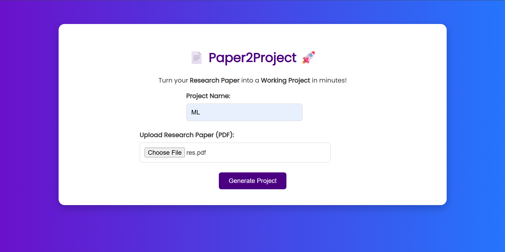
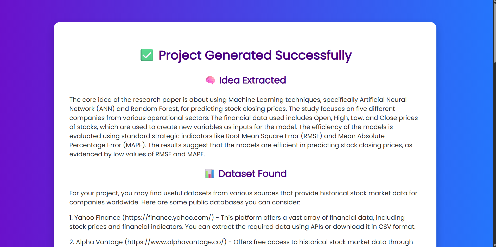
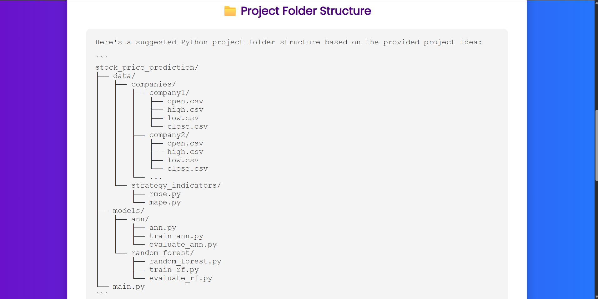
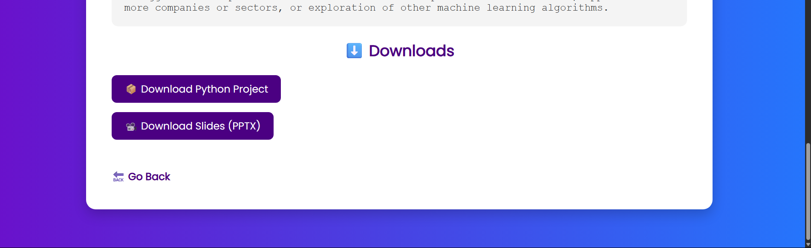

<h1 align="center">📄 Paper2Project</h1>

<p align="center">
  <em>Transform any research paper into a working Python project & presentation – instantly!</em>
</p>

<p align="center">
  
  
  
  
</p>

---

## 🧠 What is Paper2Project?

> **Paper2Project** is a GenAI-based tool that allows you to upload a research paper and automatically generate:
> 
> ✅ A Python project structure with starter code  
> ✅ A summarized PowerPoint presentation  
> ✅ A curated dataset suggestion for experimentation  

All this, directly from a single PDF! 🧾 ➜ 💻📊

---

## 🔥 Features

- 🔍 **PDF Analysis**: Extracts the core idea from the uploaded research paper
- 📂 **Auto Project Generator**: Builds a complete folder structure with boilerplate code
- 📊 **Dataset Suggestion**: Recommends relevant open-source datasets with direct links
- 🎞️ **Slides Generator**: Creates a PowerPoint presentation summarizing the paper
- 💾 **One-Click Download**: Instantly download your generated Python project and slides
- 🎨 **Modern UI**: Sleek interface with animations and responsive layout

---

## 📸 Screenshots


## 🖥️ Main Page


---

## ⏳ Loading Page


---

## ✅ Result Page


---

## 🗂️ Project Structure


---

## 📥 Download PPT and Project Files


## ⚙️ How It Works

1. 📝 Enter a project name and upload a research paper (`.pdf`)
2. 🤖 LLM extracts the core idea
3. 🔍 Dataset is searched and summarized
4. 🐍 Project structure and boilerplate code are generated
5. 🖼️ PowerPoint slides are created
6. ⬇️ Files are offered for download

---

## 🛠️ Tech Stack

| Component    | Tools Used |
|--------------|-------------|
| **Frontend** | HTML, CSS, JS (Vanilla) |
| **Backend**  | Python, Flask |
| **GenAI**    | Ollama LLM (or OpenAI/Groq API) |
| **OCR**      | Tesseract OCR / Google Vision API (optional) |
| **Slides**   | `python-pptx` |
| **Project Output** | Auto-generated `.py` & `.pptx` files |

---

## 🚀 Getting Started

### 🔧 Prerequisites

Make sure Python 3.10+ is installed.

Install dependencies:


```bash
pip install flask python-pptx

---

Any leads are appreciated—please feel free to contribute and help make this project better.